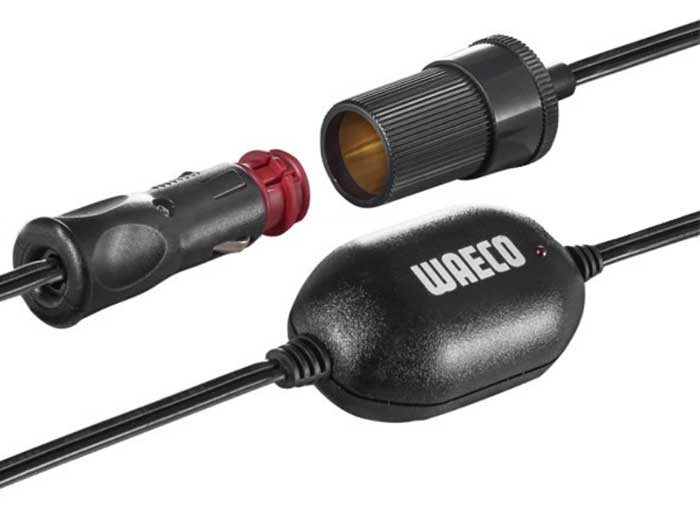
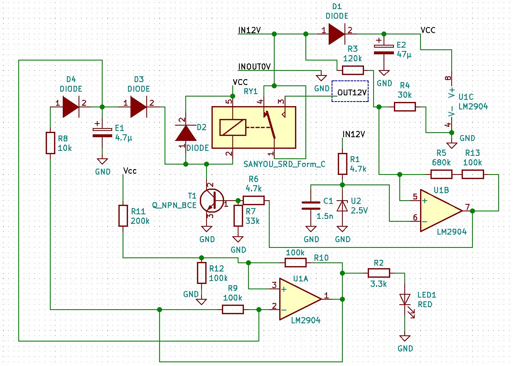
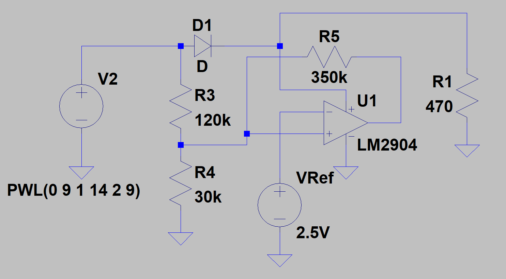

# Introduction

This DIY project describes how a car battery monitoring system has been analyzed and modified to lower its too-high disconnection threshold

Hope this work can help and inspire others with similar concerns

## The Device: *WAECO Coolpower M50U* 12V Battery Voltage Monitor

This little protection monitor is intended to be connected to the car cigarette lighter as an extender. It sales at around €20 and is equipped with an automotive grade relay (*Sanyou SRD-S-112D*) that will cut the power downstream when voltage drops to 11.6 Volts (*cut-out*) and it will only resume connection when 12.6 V (*cut-in*) thanks to an hysteresis

A red monitoring LED will turn on when connection is active and a pulse flashing will appear when circuity disconnects the downstream load

Note: this device was purchased in 2017 and as of writing (mid-2019) *WAECO* is now *[DOMETIC](https://www.dometic.com)*

# The Problem

The idea is to connect a cool box at night when travelling and then protect the car battery from an harmful deep discharge. Then a cut-out of 11.6 Volts is fine as we could measure

However the thing is the cool box current induces a 1 Volt voltage drop in the car cabling: even when battery is at 12.5 Volts, cool box is disconnected and will only reconnect when we start the engine

# Circuitry

We disassembled the device (easy to crack open with a screw driver) and carefully examined the PCB with an USB microscope, a DVM, and came up with schematics under [KiCad](http://kicad-pcb.org) (5.1.2). See *lvd.sch* and *lvd.pdf*:

On the schematics, we can see the voltage detection with its cut-out/cut-in hysteresis is made by U1B and U1A is the LED flashing circuit

# LTSpice Simulation

Voltage detection has been modelized with **[LTSpice](https://www.analog.com/en/design-center/design-tools-and-calculators/ltspice-simulator.html) XVII** (see *compare.asc* in dedicated folder):

Note: for simplification, *R5* is is fact *R5* and *R13* in series

# Calculations

As with the LTspice simulation above which represents the voltage detection circuitry (except R5 and R13 in series are replaced by R5 simply). If we call

- *Vref*: the 2.5 V set on the negative input of the op amp
- *V*: the sensed input voltage
- *Vdrop*: the voltage drop from *V* when the op amp is positively saturated
- *Voutlow*: the voltage when the op amp is negatively saturated
- *Vs*: which is the op amp output voltage: either *V - Vdrop* or *Voutlow*

Then, if we call a3, a4, and a5 current through those resistors, we can write:

- *a4 = a3 + a5*

where:

- *a3 = (V - Vref) / R3*
- *a4 = Vref / R4*
- *a5 = (Vs - Vref) / R5*

First case is when op amp is positively saturated which gives us the **low** threshold:

- *Vref / R4 = (V - Vref) / R3 + ( V - Vdrop - Vref) / R5* [1]

when resolved this **low** threshold is given by:

- **(Vref/{R3//R4//R5} + Vdrop/R5) x {R3//R5}**

where *{Rx//Ry//Rz...}* denotes resistors in parallel: *1/(1/Rx + 1/Ry + 1/Rz + ...)*

Second case is when op amp is negatively saturated which gives is the **high**, using equation [1] again gives:

- **(Vref/{R3//R4//R5} - Voutlow/R5) x R3**

# Modifications Made

Formulae above have been entered in a spreadsheet (*compare.fods* in LTSpice folder)

Playing with different resistor values, we saw the minimum change that could be made was to keep R3, R4, and change R5 (indeed R5 + R13): for example changing R5 from 760 kΩ to 350 kΩ, which shifts thresholds to 10.43 V and 13.36 V

Measurements told a little different story and we decided to keep R13, remove R5, and replace it with a 100 kΩ resistor and a 200 kΩ multi-turn trimmer in series

Those through-hole components have been glued on the top side of the PCB

